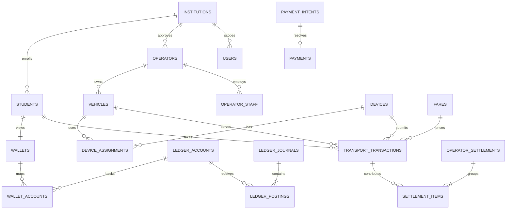

# Database design

**Status:** Draft for Phase 1 implementation  
**Financial boundary:** The pilot supports mock/non-cash credit only. A future regulated provider processes and holds funds; this schema records verified provider events, mobility entitlements, and internal operational accounting.

## ERD



## Conventions

- Use `uuid` primary keys and `timestamptz` timestamps.
- Store money only as `amount_minor bigint` with `currency char(3)`; never use floating point.
- Tenant-owned data carries `institution_id`, is server-scoped, and is protected with PostgreSQL row-level security.
- Immutable financial and audit rows have no update/delete path. Corrections use explicit reversals.

## Tables

| Area | Tables | Important fields and rules |
|---|---|---|
| Identity | `institutions`, `users`, `roles`, `permissions`, `user_role_assignments`, `sessions` | `students` uniquely maps verified `(institution_id, student_number)`; roles are evaluated server-side. |
| Mobility | `operators`, `operator_staff`, `vehicles`, `routes`, `route_stops`, `fares` | Normalize vehicle registration and require uniqueness; fares are effective-dated and cannot overlap for the same eligible route/operator/student-category tuple. |
| Credential/device | `student_credentials`, `devices`, `device_assignments`, `offline_policy_bundles`, `offline_batches` | QR data remains opaque; device assignments cannot overlap for an active vehicle/conductor context. |
| Rides | `transport_transactions`, `transaction_events`, `ride_tickets` | Transaction mode is `ONLINE` or `OFFLINE`; lifecycle events are append-only. |
| Provider boundary | `payment_providers`, `payment_intents`, `payments`, `webhook_events` | Only development `MOCK_PSP` is enabled. Provider event/ref values are unique and verification state is retained. |
| Finance | `ledger_accounts`, `ledger_journals`, `ledger_postings`, `wallets`, `wallet_accounts`, `operator_payables`, `operator_settlements`, `settlement_items` | Ledger is source of truth; the student balance is a rebuildable projection. Settlement is simulated only in pilot. |
| Governance | `audit_events`, `idempotency_keys`, `fraud_alerts`, `complaints`, `reconciliation_runs`, `reconciliation_items` | Every privileged action has request ID and actor; reconciliation exceptions are tracked to closure. |

## Financial invariants

1. A posted journal has at least two postings, and debit totals equal credit totals in each currency.
2. A payment can create only one funding journal; a confirmed ride can create only one ride-charge journal.
3. Posted journals and postings cannot be changed or deleted. Reversal creates a compensating journal referencing the original.
4. An external provider reference is unique per provider; an idempotency key is unique by tenant, actor/device, and endpoint.
5. Each ride, webhook, and offline transaction has its own durable business identifier, independent of the shorter-lived idempotency cache.

### Journal examples

```text
Mock $10 top-up
  debit  Mock PSP clearing asset                 1,000 cents
  credit Student mobility-credit liability       1,000 cents

$1 ride with 2% platform fee
  debit  Student mobility-credit liability         100 cents
  credit Operator payable                            98 cents
  credit Platform fee clearing/revenue                2 cents
```

The chart of accounts, tax, legal liability treatment, and settlement timing require NUST/partner/legal approval before real value is introduced.

## Core integrity indexes

```text
unique (institution_id, client_transaction_id)
unique (device_id, device_sequence)
unique (institution_id, credential_nonce_hash)
unique (provider_id, provider_event_id)
unique (provider_id, provider_payment_reference)
unique (institution_id, actor_id, endpoint, idempotency_key)
unique (student_id, currency) on wallets
```

## Reconciliation

The platform reconciles five sources: provider events, journal postings, balance projections, ride transactions, and operator settlement records. Differences create immutable `reconciliation_items`; no component silently modifies balances.

For the pilot, settlement progresses only as `DRAFT → APPROVED → SIMULATED_PAID`. It does not transmit a payout instruction.

## Development seed data

All seed data is fictional and marked development-only: one NUST tenant, two operators, four vehicles, three illustrative routes (NUST–CBD, CBD–NUST, NUST–Pumula), ten students, test devices, test credentials, a subsidy case, and mock success/failure/duplicate-payment and online/offline ride scenarios. It must never imply official NUST routes or real student/operator data.
